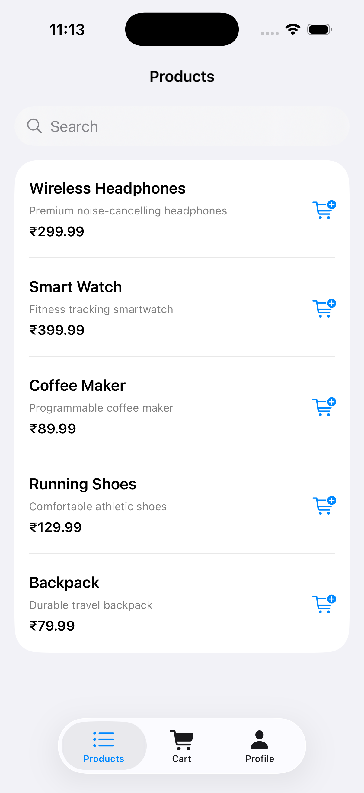
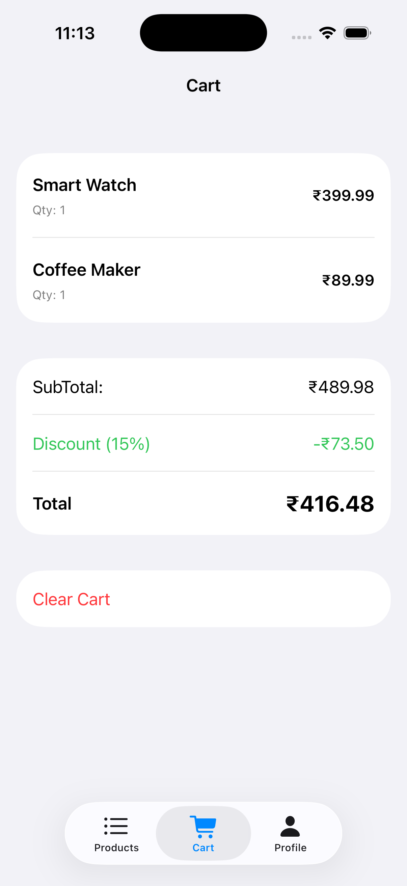
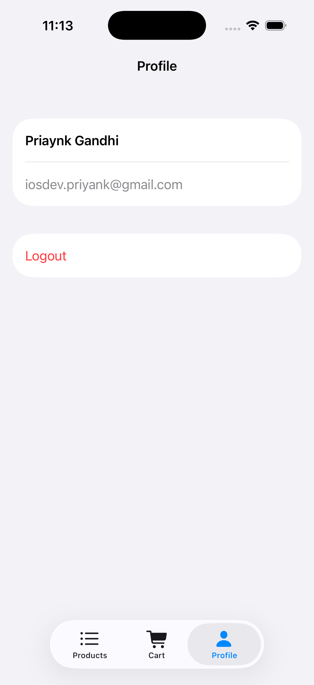

# Swift Singleton Architecture Example

[](https://swift.org)
[](https://developer.apple.com/ios/)
[](LICENSE)
[](CONTRIBUTING.md)

A production-ready **SwiftUI Shopping App** demonstrating **modern Swift 6 architecture**, clean Singleton usage, protocol-based dependency injection, concurrency-safe actors, and a complete testing strategy.

> 📖 **Companion article:** *Meet Singleton: The Friend Who Shows Up Everywhere*  
> https://medium.com/@iosdev.priyank/meet-singleton-the-friend-who-shows-up-everywhere-b0fc4938e767

---

## 📱 What This Repository Demonstrates

- 🚀 **Full Swift 6 Concurrency** with isolation and Sendable correctness  
- 🧩 **Protocol-Based Dependency Injection** — testable & flexible  
- 🔒 **Actor-Isolated Shared State** — thread safe by design  
- 🎨 **@MainActor for UI State Only**  
- 🧹 Clean architecture with **no God Singletons**  
- 🧪 Comprehensive **unit + integration tests**  
- 📦 Modular, scalable folder structure  

---

## 🎬 Screenshots
| Products Screen | Cart Screen | Profile Screen |
|----------------|-------------|----------------|
|  |  |  |

---

## 🏗️ Architecture Overview


---

## 📂 Project Structure


---

## Quick Start

### Requirements

- **Xcode 15+**
- **iOS 17+**
- **Swift 6.0**
- **macOS Sonoma (14+)**

### Install & Run

```bash
git clone https://github.com/iosdevpriyank/ShoppingApp.git
cd ShoppingApp
open ShoppingApp.xcodeproj
```

### Running Tests
```bash
# Run all tests
cmd + U

# Or via command line
xcodebuild test -scheme ShoppingApp -destination 'platform=iOS Simulator,name=iPhone 15'

# Run specific test file
xcodebuild test -scheme ShoppingApp -only-testing:ShoppingAppTests/CartViewModelTests
```

## Key Architecture Patterns
***1. Swift 6 Dependency Injection Pattern***
- **The Modern Approach:**
```swift
@MainActor
final class CartViewModel: ObservableObject {
    private let cart: CartReadable & CartWritable
    
    // Swift 6: Optional with nil-coalescing
    init(cart: (CartReadable & CartWritable)? = nil) {
        self.cart = cart ?? CartStore.shared
    }
}

// Production: Clean instantiation
let vm = CartViewModel()

// Tests: No await needed!
let vm = CartViewModel(cart: mockCart)
```
**Why this matters:**

- No await required in tests
- Default evaluation inside init (not at call site)
- Swift 6 strict concurrency compliant
- Clean, readable code

**Old pattern (don't use):**
```swift
// Requires await everywhere
init(cart: CartReadable & CartWritable = CartStore.shared) {
    self.cart = cart
}

// Forces this in tests:
let vm = await CartViewModel(cart: mockCart)  // Annoying!
```
***2. Protocol-Based Abstractions***
```swift
// Define capabilities, not implementations
protocol CartReadable: Sendable {
    func items() async -> [CartItem]
}

protocol CartWritable: Sendable {
    func add(_ item: CartItem) async
}

// Actor implements protocols
actor CartStore: CartReadable, CartWritable {
    static let shared = CartStore()
    private var items: [CartItem] = []
    
    private init() {}  // Singleton pattern
    
    func items() async -> [CartItem] { items }
    func add(_ item: CartItem) async { items.append(item) }
}
```
**Benefits:**
- ViewModels depend on protocols, not concrete types
- Easy to mock for testing
- Can swap implementations without breaking code

***3. Actor-Isolated Mutable State***
```swift
actor CartStore {
    private var items: [CartItem] = []  // Thread-safe!
    
    func add(_ item: CartItem) async {
        items.append(item)  // No race conditions
    }
}
```
**Why actors?**
- Automatically Sendable
- Compiler-enforced isolation
- No manual locks needed
- Data race prevention

***4. MainActor for UI State Only***
```swift
@MainActor
final class UIState: ObservableObject {
    @Published var isLoggedIn = false
    @Published var currentUser: User?
    
    // UI state only - keep it lightweight!
}
```
***Golden Rule:*** Never use *@MainActor* for:

- Network operations
- Heavy computations
- File I/O
- Image processing

***5. Pure Business Logic***
```swift
struct DiscountEngine: Sendable {
    func calculate(subtotal: Double) -> Double {
        if subtotal >= 200 { return subtotal * 0.85 }  // 15% off
        if subtotal >= 100 { return subtotal * 0.90 }  // 10% off
        return subtotal
    }
}
```
**Benefits:**
- Deterministic (same input = same output)
- No side effects
- Trivial to test
- No dependencies

---

### Learning Path
**New to this architecture?** Follow this order:

**1. Start with Protocols (Core/Protocols/)**
- Understand the contracts
- See what capabilities are defined

**2. Study Services (Services/)**
- See how protocols are implemented
- Notice actor usage for thread safety

**3. Explore Features (Features/Cart/)**
- See dependency injection in action
- Understand ViewModel patterns

**4. Read Tests (Tests/UnitTests/)**
- Learn testing strategies
- See mocks in action

**5. Run the App**
- Experience it all working together
- Modify and experiment!

---
### Troubleshooting
**Issue:** ***"Main actor-isolated property accessed from nonisolated context"***
**Solution:** Use the optional parameter pattern
```swift
// Don't do this
init(ui: UIState = UIState.shared) { ... }

// Do this
init(ui: UIState? = nil) {
    self.ui = ui ?? UIState.shared
}
```

**Issue:** ***"Call to actor-isolated method requires await"***
**Solution:** Add `await` when accessing actor methods
```swift
// Correct
let items = await cartStore.items()

// Wrong
let items = cartStore.items()  // Compiler error
```

**Issue:** ***Tests fail with "No async operations in await expression"***
**Solution:** Remove unnecessary `await`:
```swift
// Wrong
await sut.calculateTotal()  // If calculateTotal is synchronous

// Correct
sut.calculateTotal()
```
